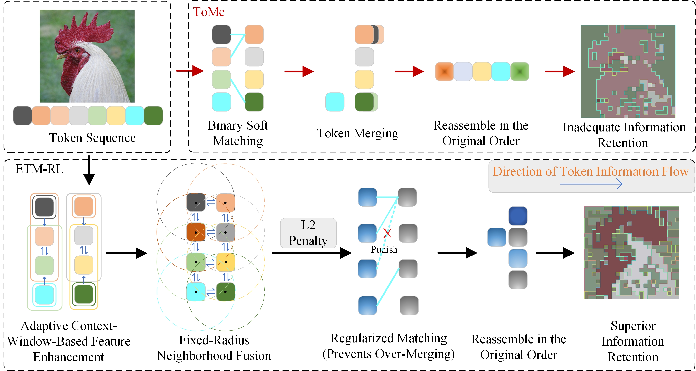

# Enhancing Vision Transformers: Efficient Token Merging for Reduced Information Loss

## What is ETM-RL?


Thanks to ToMe.ETM-RL made improvement based on ToMe.For details on ToMe, please visit http://github.com/facebookresearch/ToMe. 

**ToMe Pipeline:** A straightforward **BSM** matching process that often leads to information loss, especially for foreground tokens.

**ETM-RL Pipeline:** Our method features a multi-stage feature enhancement pipeline, including **adaptive contextual windows** and **fixed-radius neighborhood fusion**, which significantly preserves critical information and structural integrity.

## Usage

1、ETN-RL mainly reduces image information loss through two methods: **an adaptive contextual window mechanism** and **a fixed-radius k-nearest neighbor strategy**.We have provided the detailed code for these two methods in the **merging.py** file and applied them in the method called **bipartite_soft_matching_xincheng** to replace the original **bipartite_soft_matching** (BSM) method.If you only want to use one of the methods to enhance your image information, please comment out the others in the corresponding method.
 

2、We provide a test script -- test.py, which can compress the images you want to process. First, you need to modify the absolute path of the image you want to process, and then choose different r values to perform different degrees of merging. **r=1 indicates a low degree of merging**, while **r=25 indicates a very high degree of merging**.Then run：
```
python test.py
```
## Comparison effect images of ToMe and ETM-RL


## This work will be directly related to the manuscript submitted to The Visual Computer.
